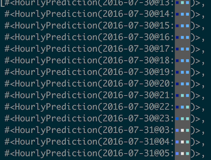

# SkyPrediction

Get alerted when something interesting is going to be visible in the night sky in your area, taking into account weather predictions, light pollution, and more.

### Usage
> iex -S mix

> iex> SkyPrediction.get_data_for("Seattle")

> iex> WeatherPrediction.get_good_candidates_for("Seattle")

### About this app

This app is being developed to help me learn the excellent Elixir programming language, and hopefully to provide a useful service to amateur stargazers. This app utilizes data from ClearDarkSky (http://cleardarksky.com) to determine if there will be clouds or other obstacles to viewing ISS flyovers, Iridium flares, and whatever else I can think of.

This project needs more gifs
